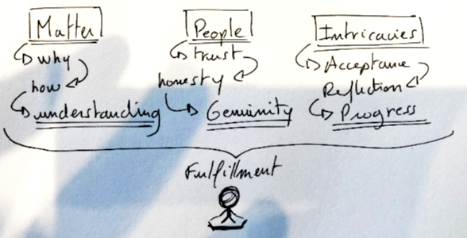

# Introduction

I see all those kids, and they remind me of my own childhood. They followed some education, learnt everything through principles, examples or life events, they’ve been put into boxes to shape their characters and their future. They mimic the world they live in and deal as shown or required by their parents, friends, superiors.

Along the way, those kids have noticed that humanity was full of paradoxes, unfairness and complexities. They probably started to ask themselves why but were shut-down in their attempt to understand the world with a different, new perspective and were more or less forced to comply with the rules just like their peers. Nobody ever really gave them real, thoughtful explanations, a lens of clear understanding, a way to deal with those things and their relative degree of rationalities.

* Why is this person better than me at doing something?
* How do I figure this one thing I master better than everyone else?
* Why do I struggle to thrive and how can change this dynamic?
* Is there a way to do things differently, to succeed, and be happy?

All those questions are legitimate. We have been and we are still those kids. We didn’t find a way through all the intricacies of the world. Instead, our search for meaning has been often muted and we had to follow a certain order of things to find ourselves lost in our inability to truly adapt and evolve as human beings.

It hurts but it’s true. I have always been wondering why and how we have let this happen?

Philosophy was never in the early programs, kindness and forgiveness have been merely taught as core principles to follow, without reflection on what it actually means and implies. Awareness was annihilated and singularities have been treated as commodities, making some of us, as grown-up kids, lost in society, unable to find our true-self or without a meaning for what we do with our life.

If only someone had shown us earlier the value of asking why, of embracing ignorance, our natural curiosity for any matters would have been nurtured. If we had been told about the value of shared trust and honesty, we would have developed more often and more consistently truly genuine relationships with people. If we had been supported while facing the intricacies coming from difficulties, efforts and failures, our life balance would have been preserved instead of being pushed to the limits where daemons and neurosis rise up.

But we are here, we are breathing and we are aware of the imperfections that have paved our way this whole time. And it’s not too late to gain a sense of control, to make small changes one step at a time, to overcome our fear of achievement.

It’s demanding to be good parent, a real friend, an accomplished person. Destruction takes seconds, construction takes ages. Resistance is easy,  action requires efforts. We are, as human beings, in a never-ending growing process with an omnipresent risk of slipping away and it’s our own responsibility to unlock the matter that will help us thrive as a person, find a balance and improve our life.

Of course it’s hard to know where and how to start, or what to expect even though we deeply feel and know that we must go after this next best version of ourselves. It’s very easy to explain the course of actions afterwards but it’s undoubtedly hard to generate universal and applicable principles from them. Rules only precedes others that come aside, on top, following or in replacement.

No real understanding nor action come without being truly open-minded. It’s where it all starts, it’s the first principle of all, the one key without which you can’t open the other doors. It’s the beginning of all future iterations that hopefully will help you thrive as a person.

Open-mindedness is about our willingness to listen to other people and consider new ideas, suggestions, and opinions. Looking backward, think about those times when you were wrong and acknowledged it. Looking forward, when you face an argument, try to put aside what you believed were true or obvious to focus on the point of view from the other side as potentially a legitimate opinion if not the entire truth.

I have written this book in the honest people's favour who are open to change and progress in their life. But that doesn’t mean you should put too much pressure on yourself, life is giving you enough and open-mindedness is a process of reflection that requires patience.

**Notice for honest readers:** It is only your decision to go forward and read the following chapters. I wouldn’t advise you to put too much effort into it, it’s a willingful journey, nobody is forcing you. Just don’t skip parts, don’t apply fast reading methods, it’s short enough to be read thoroughly.

If you don’t feel like it’s the right moment, put a reminder to give it another try in a couple weeks, and see how it goes.

I really hope you’ll enjoy this reading :\)

